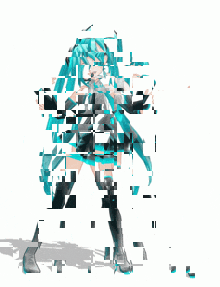

# image_patchwork


This is a python tool that blends images as a patchwork.
Using opencv and numpy.

## Usage

clone this repo and install the requirements:

```bash
git clone https://github.com/wowowo-wo/image_patchwork
cd image_patchwork
pip install -r requirements.txt
```
and run:
```bash
python3 --images 'PATH of image1' 'PATH of image2' --ratios 0.1 0.2 ... --block_size 1 --output 'PATH of output image'
```

or you can run this tool with a GUI using Streamlit (It is more useful):

```bash
pip install streamlit
streamlit run gui.py
```

then, open the URL shown in your brouser.

## Digital Cubism

Running this program on a series of images of the same subject taken from different angles or at different times, you get some visually interesting results.
Each pixel or block in the final output can come from a different moment in time or a different viewpoint. So in the end, you get an image that feels like a mix of different timeframes and perspectives all mashed into one, kind of like "digital cubism."
The images above in this README were created by repeating this process multiple times, adjusting the block size each time, and mixing the previous output back into the input.

## gif
<p>



</p>

## Requirements

opencv-python
numpy
